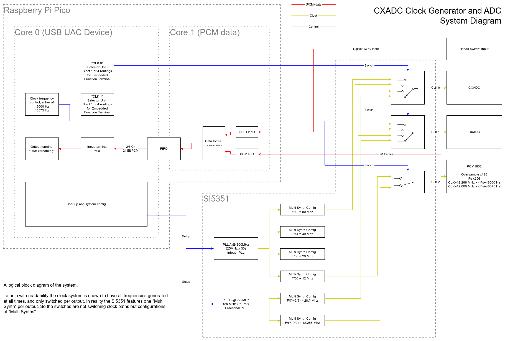
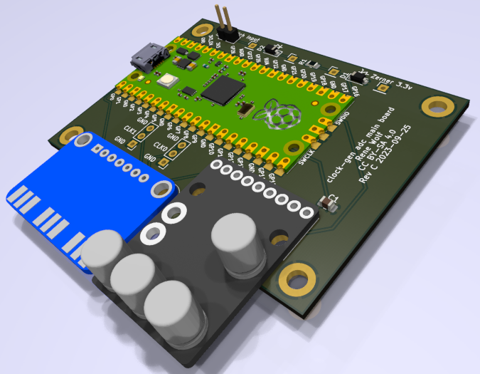

# [CXADC][cxadc] clock generator and audio ADC

A project to synchronously clock two (or more) [CXADC][cxadc] PCIe cards and an extra audio ADC from an external clock generator.
This enables sync capturing of two RF streams (e.g. RF Video and RF HiFi audio from a VHS), in addition to a stereo audio stream (e.g. linear VHS audio).

The project consists of 3 main components:
- A [PCB adapter][self-pcb-adapter] that is installed per PCIe card.
  It contains only a couple of passive components per [cx25800-11z data sheet][google-cx25800-datasheet].
- The [main PCB][self-pcb-main] that combines a [Raspberry Pi Pico][pi-pico], with an [Adafruit Si5351A Clock Generator Breakout Board][si5351-adafruit], and a [PCM1802 board][ali-pcm1802-search].
- The firmware for the [Raspberry Pi Pico][pi-pico], that implements a USB sound card and also controls the [Si5351A][si5351-adafruit] clock generator.
  The firmware is available pre-build and can be flashed to the [Raspberry Pi Pico][pi-pico] without additional tools.

The two PCBs can be manufactured with [JLCPCB][jlcpcb] cheaply, and assembled easily with basic soldering tools.
If you choose to order from JLC, have a [look here](hardware/jlc-2023-09-order-example.png) for the specific settings.

Have a look in the [mechanical section](mechanical) for some 3D printable parts as well.

## System overview

The above shows a logical block diagram of the system.

The brain of the system is a [Raspberry Pi Pico][pi-pico] that implements a [USB UAC][wiki-usb-uac] device (aka a usb sound card).
The [USB UAC][wiki-usb-uac] device can be used to stream the captured samples from the [PCM1802][pcm1802-product] as a regular sound source.
In addition to audio streaming it also offers control over the sample rates for the ADC and [CXADC][cxadc] cards.
[USB UAC][wiki-usb-uac] is supported by all major OS and should work without the need for any additional drivers.

The [USB UAC][wiki-usb-uac] offers two sample rates for the [PCM1802][pcm1802-product], that can be switched via a UAC clock source.
This is [how a usual OS][multi-samplerate] would do it, and the sound source should be listed with two sample rates via ALSA etc.
So just select your desired capture rate with your sound recorder of choice.
To enable clock frequency switching on the [CXADC][cxadc] cards a UAC clock source would most likely not work.
A the very least it would require low level interaction with the UAC device controls.
ALSA and other sound systems will configure UAC clock sources when capturing from a linked stream.
The [CXADC][cxadc] cards however are not linked to any sound stream you can capture from the UAC device.
So instead the various clock rates are implemented as (fake) internal audio streams that can be switched with a UAC switch control.
Internal audio streams are per UAC specification not available to the outside and as such should not trouble OS sound systems for not offering a way to access their data.
Every clock frequency is represented as one (virtual/internal/fake) input stream, and each of the two [Si5351A][si5351-adafruit] clock output is represented as one (virtual/internal/fake) output.
So to the OS / sound system this looks like a switch matrix of various audio stream sources to two outputs.
This should generate entries in the usual mixer widgets / apps, that let you control your other sound cards.
But instead of switching actual audio streams, the UAC selector unit switches clock frequencies for the attached [CXADC][cxadc] cards.

To help with readability and to more closely match the USB UAC implementation, the above diagram shows the clock system to have all frequencies generated at all times, and then switched per output.
In reality the [Si5351A][si5351-adafruit] features only one "Multi Synth" per clock output. 
So the switches are not switching clock paths but rather configurations of "Multi Synths".

The setup offers a couple of options for both the [PCM1802][pcm1802-product] audio ADC and the [CXADC][cxadc], but not all of them are of equal quality.
Inside the [Si5351A][si5351-adafruit] clock generator, two [PLLs][pll-wiki] are used to generate intermediate frequencies.
Those intermediate clock are then further divided to get the desired clock frequencies at the 3 outputs.

PLL A is running in integer mode, which means only whole number multipliers are used, resulting in no added [jitter][jitter-wiki].
Further more the subsequent "multi synth" dividers are also in integer mode, again resulting in no added [jitter][jitter-wiki].
But this limits the clock outputs options to only frequencies that can be produced by one multiplication and one division with only whole numbers.
Based on the 25 MHz source that is included on the [Si5351A][si5351-adafruit] board, this enables CXADC *sampling clocks of 20 MHz, 40 MHz and 50 MHz*.
The [PCM1802][pcm1802-product] needs a clock of 256 times the frequency of the desired output audio sampling rate.
The PLL A path generates a 12 MHz output which results in an exact (without rounding error) *46875 Hz / 46.875 kHz* sample rate for the audio stream.
This uncommon rate does not degrade the performance of the [PCM1802][pcm1802-product] ADC and offers analog bandwidth that is above CD quality.
Using common tools (sox or ffmpeg) the captured pcm data can be fully automatically resampled to the more common 48 kHz or 44.1 kHz in an offline processing step.

PLL B is running is running in fractional mode, yielding an increased clock [jitter][jitter-wiki].
Together with fractional configuration in the subsequent "multi synth" dividers, two more clock rates are possible.
The [CXADC][cxadc] can be clocked with the same frequency as the stock crystal 28.636360 MHz.
And the [PCM1802][pcm1802-product] can be clocked with a 12.288 MHz, giving the more common 48 kHz as output sample rate.
In ADCs [the higher the clock jitter the worse the sampling quality][jitter-paper] will be.
So you should avoid these sampling rates if you can and only use the ones from the integer mode PLL A.

## PCB 1 - VT610ex clock generator insert

A PCB adapter to replace the quarz oscillator on a VT610ex PICe capture card.

*TODO build*

## PCB 2 - Clock generator and ADC main board

A PCB that combines a [Raspberry Pi Pico][pi-pico] with a [Adafruit Si5351A Clock Generator Breakout Board][si5351-adafruit], and a [PCM1802 board][ali-pcm1802-search].
The clock generator produces 3 clocks, clock 0 and clock 1 are available for two [CXADC][cxadc] cards, clock 2 drives the [PCM1802 ADC][ali-pcm1802-search].
The Pi controls the clock generator and also implements a USB audio (UAC) device.
The UAC device outputs the captured samples from the [PCM1802 ADC][ali-pcm1802-search], in addition to a 3rd channel that samples a GPIO pin.
This GPIO pin can be connected to the head switching signal of a VHS player, for later automatic synchronization.

*TODO build*

## Installing

Compatible with the
- *VT610EX Rev:SC3A VTImage 19.07* capture cards, white pcb, featuring a *CX25800-11Z*

*TODO install steps*

## Versioning

The firmware / software part is using [Semantic Versioning][semver], referring to the USB device interface.
Tags on this repository will carry the firmware / software version.

The PCBs are versioned with a letter revision.
These revisions do not imply any compatibility, and are solely used to differentiate one revision from another.
PCB revision overview:
- VT610ex clock generator adapter
  - Revision A - never released
  - Revision B - first public release
- Clock generator main board
  - Revision A - first public release
  - Revision B - fixes the IO VDD for Si5351, which should be 3.3V, Rev A erroneously had it at VSys
  - Revision C - fixes the 3.3V from PCM1802 being driven by Pi Pico, instead this is an output and should be left open

## Changelog

See [CHANGELOG.md](CHANGELOG.md).

## Releases

See [releases](https://gitlab.com/wolfre/cxadc-clock-generator-audio-adc/-/releases).

# License

The content of this repository is under various licenses.
The PCB parts are generally under *Creative Commons Attribution-ShareAlike 4.0*, but contains external sources (with compatible licenses).
The source code is mostly under 3-Clause BSD, but contains external sources with compatible licenses mixed in.
Source files carry an [SPDX][spdx] header to indentify.
For details see the individual *LICENSE\** files in the respective folders they apply to, firmware zip packages contain a copy of all the applicable license files.

[cxadc]: https://github.com/happycube/cxadc-linux3/
[pi-pico]: https://www.raspberrypi.com/products/raspberry-pi-pico/
[si5351-adafruit]: https://www.adafruit.com/product/2045
[ali-pcm1802-search]: https://www.aliexpress.com/w/wholesale-PCM1802.html?SearchText=PCM1802
[pcm1802-product]: https://www.ti.com/product/PCM1802
[jlcpcb]: https://jlcpcb.com
[google-cx25800-datasheet]: https://www.google.com/search?q=DSH-201233A
[self-pcb-adapter]: #pcb-1-vt610ex-clock-generator-insert
[self-pcb-main]: #pcb-2-clock-generator-and-adc-main-board
[semver]: https://semver.org/
[wiki-usb-uac]: https://en.wikipedia.org/wiki/USB#Audio_streaming
[multi-samplerate]: https://stackoverflow.com/questions/41702932/usb-audio-class-2-0-how-to-support-multiple-bit-rates-sample-rates
[pll-wiki]: https://en.wikipedia.org/wiki/Phase-locked_loop
[jitter-wiki]: https://en.wikipedia.org/wiki/Jitter
[jitter-paper]: https://www.analog.com/media/en/reference-design-documentation/design-notes/dn1013f.pdf
[spdx]: https://spdx.dev/
