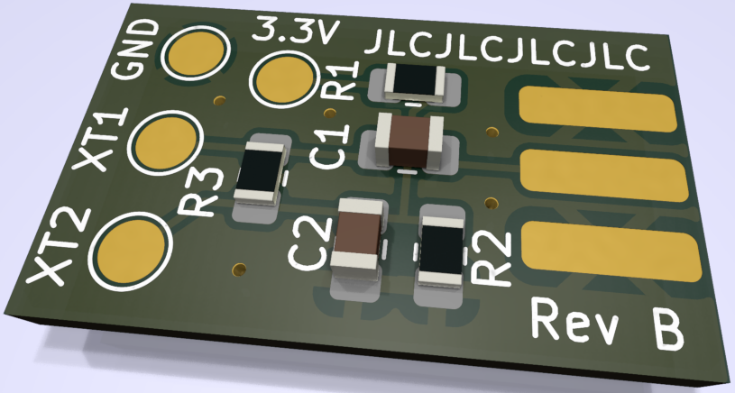
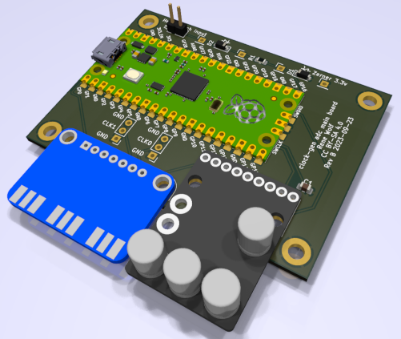

# [CXADC][cxadc] clock generator and audio ADC

A project to synchronously clock two (or more) [CXADC][cxadc] PCIe cards and an extra audio ADC from an external clock generator.
This enables sync capturing of two RF streams (e.g. RF Video and RF HiFi audio from a VHS), in addition to a stereo audio stream (e.g. linear VHS audio).

The project consists of 3 main components:
- A [PCB adapter][self-pcb-adapter] that is installed per PCIe card.
  It contains only a couple of passive components per [cx25800-11z data sheet][google-cx25800-datasheet].
- The [main PCB][self-pcb-main] that combines a [Raspberry Pi Pico][pi-pico], with an [Adafruit Si5351A Clock Generator Breakout Board][si5351-adafruit], and a [PCM1802 board][ali-pcm1802-search].
- The firmware for the [Raspberry Pi Pico][pi-pico], that implements a USB sound card and also controls the [Si5351A][si5351-adafruit] clock generator.
  The firmware is available pre-build and can be flashed to the [Raspberry Pi Pico][pi-pico] without additional tools.

The two PCBs can be manufactured with [JLCPCB][jlcpcb] cheaply, and assembled easily with basic soldering tools.
If you choose to order from JLC, have a [look here](hardware/jlc-2023-09-order-example.png) for the specific settings.

## PCB 1 - VT610ex clock generator insert

A PCB adapter to replace the quarz oscillator on a VT610ex PICe capture card.

*TODO build*

## PCB 2 - Clock generator and ADC main board

A PCB that combines a [Raspberry Pi Pico][pi-pico] with a [Adafruit Si5351A Clock Generator Breakout Board][si5351-adafruit], and a [PCM1802 board][ali-pcm1802-search].
The clock generator produces 3 clocks, clock 0 and clock 1 are available for two [CXADC][cxadc] cards, clock 2 drives the [PCM1802 ADC][ali-pcm1802-search].
The Pi controls the clock generator and also implements a USB audio (UAC) device.
The UAC device outputs the captured samples from the [PCM1802 ADC][ali-pcm1802-search], in addition to a 3rd channel that samples a GPIO pin.
This GPIO pin can be connected to the head switching signal of a VHS player, for later automatic synchronization.

*TODO build*

## Installing

Compatible with the
- *VT610EX Rev:SC3A VTImage 19.07* capture cards, white pcb, featuring a *CX25800-11Z*

*TODO install steps*

## Versioning

The firmware / software part is using [Semantic Versioning][semver], referring to the USB device interface.
Tags on this repository will carry the firmware / software version.

The PCBs are versioned with a letter revision.
These revisions do not imply any compatibility, and are solely used to differentiate one revision from another.
PCB revision overview:
- VT610ex clock generator adapter
  - Revision A - never released
  - Revision B - first public release
- Clock generator main board
  - Revision A - first public release
  - Revision B - fixes the IO VDD for Si5351, which should be 3.3V, Rev A erroneously had it at VSys

## Changelog

See [CHANGELOG.md](CHANGELOG.md).

## Releases

See [releases](https://gitlab.com/wolfre/cxadc-clock-generator-audio-adc/-/releases).

# License

The content of this repository is under various licenses.
The PCB parts are generally under *Creative Commons Attribution-ShareAlike 4.0*, but contains external sources (with compatible licenses).
The source code is under 3-Clause BSD, but contains external sources (with compatible licenses).
For details see the individual *LICENSE\** files in the respective folders they apply to, firmware zip packages contain a copy of all the applicable license files.

[cxadc]: https://github.com/happycube/cxadc-linux3/
[pi-pico]: https://www.raspberrypi.com/products/raspberry-pi-pico/
[si5351-adafruit]: https://www.adafruit.com/product/2045
[ali-pcm1802-search]: https://www.aliexpress.com/w/wholesale-PCM1802.html?SearchText=PCM1802
[jlcpcb]: https://jlcpcb.com
[google-cx25800-datasheet]: https://www.google.com/search?q=DSH-201233A
[self-pcb-adapter]: #pcb-1-vt610ex-clock-generator-insert
[self-pcb-main]: #pcb-2-clock-generator-and-adc-main-board
[semver]: https://semver.org/
