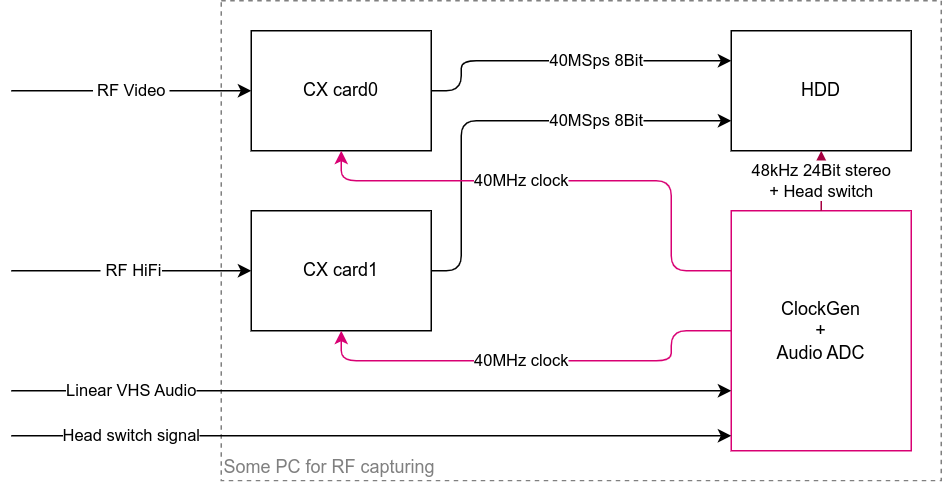
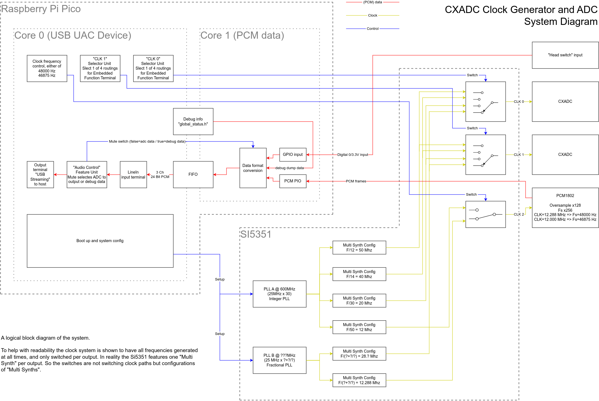
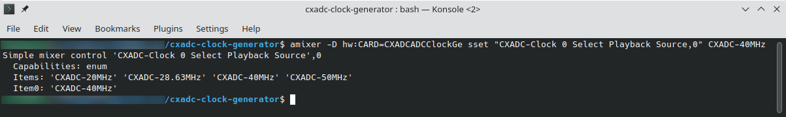

# [CXADC][cxadc] clock generator and audio ADC

A project to synchronously clock two (or more) [CXADC][cxadc] PCIe cards and an extra audio ADC from an external clock generator, for [VHS-Decode][vhs-decode] setups.
This enables sync capturing of the two RF streams (RF Video and RF HiFi audio from a VHS), in addition to a stereo audio stream (linear VHS audio).

The above picture shows the mainboard, which you would typically mount inside your capture PC, along side the 2 CXADC cards.
The below diagram shows how a typical VHS capture is setup using the clock generator + audio ADC (this project).

The project consists of 3 main components:
- A PCB adapter that is installed per PCIe card.
  It contains only a couple of passive components per [cx25800-11z data sheet][google-cx25800-datasheet].
- The main PCB that combines a [Raspberry Pi Pico][pi-pico], with an [Adafruit Si5351A Clock Generator Breakout Board][si5351-adafruit], and a [PCM1802 board][pcm1802-product].
- The firmware for the [Raspberry Pi Pico][pi-pico], that implements a USB sound card and also controls the [Si5351A][si5351-adafruit] clock generator.
  The firmware is available pre-build and can be flashed to the [Raspberry Pi Pico][pi-pico] without additional tools.

## Why you would need this

To capture VHS conveniently and then decode it with the amazing [VHS-Decode][vhs-decode], you need two [CXADC][cxadc] PCIe cards and an additional audio ADC.
One [CXADC][cxadc] card will capture the RF video stream at usually 20MSPS 10bit.
The other [CXADC][cxadc] card will capture RF HiFi audio at usually 10MSPS 8bit.
The additional audio ADC captures the linear audio track from the VHS.
So you have 3 independent pieces of hardware that each captures a part of the VHS tapes content.

Each of the 3 pieces has its own quartz oscillator, to drive its logic.
[CXADC][cxadc] PCIe cards usually come with a 28.6MHz quartz, that is commonly replaced with a 40MHz one for better performance.
The additional linear audio stream could be captured with an additional USB audio interface, which of course has its own quartz.

As every real device, quartzes have tolerances, resulting in frequency errors.
E.g. a 40MHz quartz might actually be 40.000005MHz or 39.999995MHz.
This error is due to manufacturing tolerance and basically random.
So each of the 3 quartzes will be slightly different, and you can't really know by how much.
If you just capture from one of these sources, then this tiny error does not matter.
But if you capture 3 streams that all come from the same source, a VHS tape, then it does!

So lets say that one [CXADC][cxadc] card is slightly faster than the other, because its quartz runs a bit faster than the others.
When you've finished your capture from both cards, one file will contain slightly more samples than came from the other stream.
This means the signal / information in both files is actually not aligned with each other any more, like it used to be on the VHS tape.
To align them again, you have to do (manual) post processing to find out how much they differ, and then *resample* one of them to fit the other.
The same goes for the linear audio as well, there may now be slightly more or less samples in your recorded wav file than expected.

This project solves all of this by replacing the quartz crystals on [CXADC][cxadc] PCIe cards with the output from a clock generator.
The clock generator produces the clocks for both cards from a single source (also a quartz).
This single source of course has a slight error, but as both [CXADC][cxadc] cards are now fed from the *same* source, both are now always in sync!
To also cover the linear audio capturing / recording, the project includes a [PCM1802 ADC][pcm1802-product].
This extra audio ADC is also synchronously clocked from the same clock generator, so it is also always in sync to the two [CXADC][cxadc] cards.

As an added bonus, the clock generator is programmable, so the output sample rates for the [CXADC][cxadc] cards can be changed!
This can be configured during system runtime, via the same USB audio interface that also streams the [PCM1802 ADC][pcm1802-product] samples.
And as one more feature, it also contains an additional digital input, that can be connected to the head switch signal of your VHS player.
This signal will be recorded along side the linear audio, enabling even more automation to sync up all those streams.

The above shows a 3ch recording as captured from the clock generator, a sine wave on the left, silence on the right, and a head-switch signal on the 3rd channel.
Read on to get all the details and find out how to build one yourself.

## Building one yourself

The build and installation guide can be found [over here](build-guide/README.md).
Have a look in the [mechanical section too](mechanical) for some (optional) 3D printable parts.
And once you built it, check out the [scripts](scripts) folder which holds some useful tools an examples around using this project.

## System overview and architecture

So you want to contribute, or just understand how it all works, then read on!
Lets start with a logical block diagram of the system.

The brain of the system is a [Raspberry Pi Pico][pi-pico] that implements a [USB UAC][wiki-usb-uac] device (aka a usb sound card).
The [USB UAC][wiki-usb-uac] device can be used to stream the captured samples from the [PCM1802][pcm1802-product] as a regular sound source.
In addition to audio streaming it also offers control over the sample rates for the ADC and [CXADC][cxadc] cards.
[USB UAC][wiki-usb-uac] is supported by all major OS and should work without the need for any additional drivers.
Here's the output from `arecord` when the clock gen is plugged in:

NOTE the following talks a lot about the implementation as a [USB UAC 2.0 audio device][wiki-usb-uac].
The backgrounds and details can be found in the "Device Class Specification Adopters Agreement", aka. [the USB audio specification][usb-auc-20-spec].
So you may want to read through the first 3 chapters to get the full background.

The [USB UAC device][wiki-usb-uac] offers two sample rates for the [PCM1802][pcm1802-product], that can be switched via a UAC clock source.
This is [done automatically by your OS / sound system][multi-samplerate] so just select your desired capture rate with your sound recorder of choice.
To enable clock frequency switching on the [CXADC][cxadc] cards however a UAC clock source would most likely not work.
ALSA and other sound systems will configure UAC clock sources only when capturing from a linked stream.
The [CXADC][cxadc] cards however are not linked to any audio data you could stream from the UAC device.
So instead the various clock rates are implemented as (fake) internal audio streams that can be switched with a UAC switch control.
Internal audio streams are per UAC specification not available to the outside and as such should not trouble OS sound systems for not offering a way to stream their data.
Every clock frequency is represented as one (virtual/internal/fake) input stream, and each of the two [Si5351A][si5351-adafruit] clock output is represented as one (virtual/internal/fake) output.
So to the OS / sound system this looks like a switch matrix of various audio stream sources, switched onto two outputs.
This will generate entries in the usual mixer widgets / apps, that let you control your general sound card settings.
But instead of switching actual audio streams, the UAC selector unit of course switches clock frequencies for the attached [CXADC][cxadc] cards.

This is all a bit abstract, so here's how those switches are displayed in `alsamixer` (you can switch the rates simply using the arrow keys on your keyboard):

And here's how `amixer` can be used to script switching the clock rate on output 0:

To help with readability and to more closely match the USB UAC implementation, the above system diagram shows the clock system to have all frequencies generated at all times, and then switched per output.
In reality the [Si5351A][si5351-adafruit] features only one "Multi Synth" per clock output. 
So the switches are not switching clock paths but rather configurations of "Multi Synths".

The setup offers a couple of options for both the [PCM1802][pcm1802-product] audio ADC and the [CXADC][cxadc], but not all of them are of equal quality.
Inside the [Si5351A][si5351-adafruit] clock generator, two [PLLs][pll-wiki] are used to generate intermediate frequencies.
Those intermediate clock are then further divided to get the desired clock frequencies at the 3 outputs.

PLL A is running in integer mode, which means only whole number multipliers are used, resulting in no added [jitter][jitter-wiki].
Further more the subsequent "multi synth" dividers are also in integer mode, again resulting in no added [jitter][jitter-wiki].
But this limits the clock outputs options to only frequencies that can be produced by one multiplication and one division with only whole numbers.
Based on the 25 MHz source that is included on the [Si5351A][si5351-adafruit] board, this enables CXADC *sampling clocks of 20 MHz, 40 MHz and 50 MHz*.
The [PCM1802][pcm1802-product] needs a clock of 256 times the frequency of the desired output audio sampling rate.
The PLL A path generates a 12 MHz output which results in an exact (without rounding error) *46875 Hz / 46.875 kHz* sample rate for the audio stream.
This uncommon rate does not degrade the performance of the [PCM1802][pcm1802-product] ADC and offers analog bandwidth that is above CD quality.
Using common tools (sox or ffmpeg) the captured pcm data can be fully automatically resampled to the more common 48 kHz or 44.1 kHz in an offline processing step.

PLL B is running is running in fractional mode, yielding an increased clock [jitter][jitter-wiki].
Together with fractional configuration in the subsequent "multi synth" dividers, two more clock rates are possible.
The [CXADC][cxadc] can be clocked with the same frequency as the stock crystal 28.636360 MHz.
And the [PCM1802][pcm1802-product] can be clocked with a 12.288 MHz, giving the more common 48 kHz as output sample rate.
In ADCs [the higher the clock jitter the worse the sampling quality][jitter-paper] will be.
So you should avoid these sampling rates if you can and only use the ones from the integer mode PLL A.

## Versioning

The firmware / software part is using [Semantic Versioning][semver], referring to the USB device interface.
Tags on this repository will carry the firmware / software version.

The PCBs are versioned with a letter revision.
These revisions do not imply any compatibility, and are solely used to differentiate one revision from another.
PCB revision overview:
- VT610ex clock generator adapter
  - Revision A - never released
  - Revision B - first public release
- Clock generator main board
  - Revision A - first public release
  - Revision B - fixes the IO VDD for Si5351, which should be 3.3V, Rev A erroneously had it at VSys
  - Revision C - fixes the 3.3V from PCM1802 being driven by Pi Pico, instead this is an output and should be left open

## Changelog

See [CHANGELOG.md](CHANGELOG.md).

## Releases

See [releases](https://gitlab.com/wolfre/cxadc-clock-generator-audio-adc/-/releases) for PCB gerbers and firmware images ready to flash.

# License

The content of this repository is under various licenses.
The PCB parts are generally under *Creative Commons Attribution-ShareAlike 4.0*, but contains external sources (with compatible licenses).
The source code is mostly under 3-Clause BSD, but contains external sources with compatible licenses mixed in.
Source files carry an [SPDX][spdx] header to indentify.
For details see the individual *LICENSE\** files in the respective folders they apply to, firmware zip packages contain a copy of all the applicable license files.

[cxadc]: https://github.com/happycube/cxadc-linux3/
[pi-pico]: https://www.raspberrypi.com/products/raspberry-pi-pico/
[si5351-adafruit]: https://www.adafruit.com/product/2045
[pcm1802-product]: https://www.ti.com/product/PCM1802
[google-cx25800-datasheet]: https://www.google.com/search?q=DSH-201233A
[semver]: https://semver.org/
[wiki-usb-uac]: https://en.wikipedia.org/wiki/USB#Audio_streaming
[multi-samplerate]: https://stackoverflow.com/questions/41702932/usb-audio-class-2-0-how-to-support-multiple-bit-rates-sample-rates
[pll-wiki]: https://en.wikipedia.org/wiki/Phase-locked_loop
[jitter-wiki]: https://en.wikipedia.org/wiki/Jitter
[jitter-paper]: https://www.analog.com/media/en/reference-design-documentation/design-notes/dn1013f.pdf
[spdx]: https://spdx.dev/
[vhs-decode]: https://github.com/oyvindln/vhs-decode
[usb-auc-20-spec]: https://www.usb.org/sites/default/files/Audio2.0_final.zip
