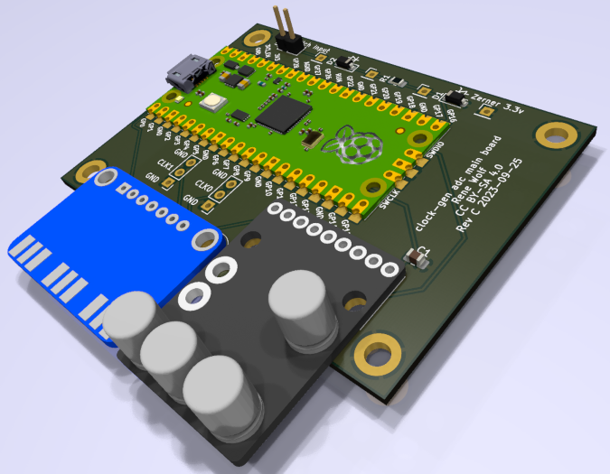
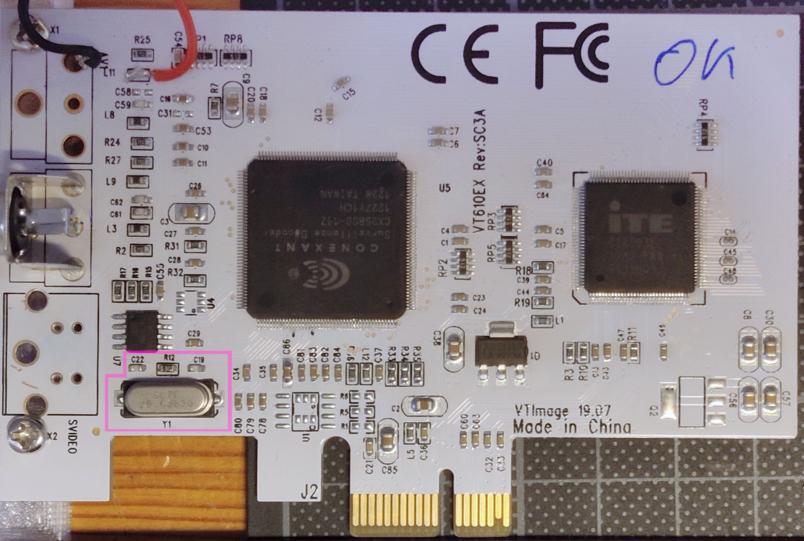
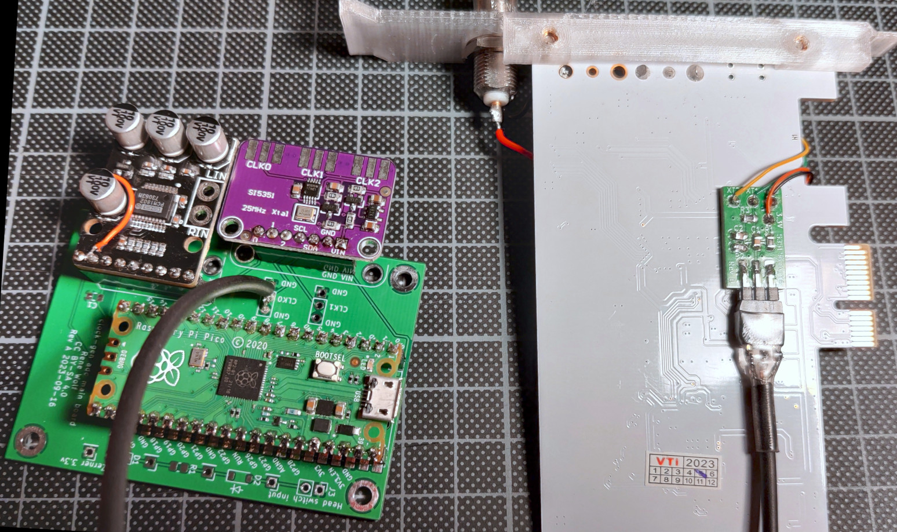

# Build and installation guide

Ahh so you've come here to build the project, *excellent*!

Before you start ordering and building, you should read the entire guide at least once so you know what to expect.
You will be assembling the project from various ready made components and solder them together.
Most components can be ordered in a finished and populated state, basically you only need to wire them up.
But the two main PCBs of this project need to be ordered with [JLCPCB][jlcpcb] and then some SMD parts populated manually.
Don't worry though all SMD parts are rather large 0805, and ordering them with [JLCPCB][jlcpcb] is fast and cheap!
The [hardware](../hardware) section of this project includes the full [KiCad][kicad] project files, so you can also generate gerbers for a different manufacturing house.

The steps covered here will assemble the electronic components and flash the firmware on the Raspberry Pi Pico.
Mounting the finished build in your particular PC / setup is beyond the scope of this guide.
You can however have a look in the [mechanical section](../mechanical) for some 3D printable parts that may suit your needs.

This guide will assume you have two PCIe CX based capture cards ready to be modded.
Have a look [over here][vhs-decode-wiki-cxcard] for some sources and options on acquiring those cards.
The instruction in here possibly work with other models, but they were tested and confirmed working with these variants:
- *VT610EX Rev:SC3A VTImage 19.07* capture cards, white pcb, featuring a *CX25800-11Z*

If your board / card variant is not listed here, go over the guide and compare the instructions to your card.
If the parts they are referring to also exist on your board, there's a good chance this guide also works for you.

## General prerequisites

You will be dealing with high frequency digital clock signals.
Even though these are more immune to problems than analog signals, you should have a [Digital storage oscilloscope][wiki-dso] at hand.
You can assemble all of this project without one, but you probably want to check signal integrity, before putting everything together.
In order to correctly assess the signals, your scope should have an analog bandwidth of at least 20MHz, better 100MHz.

You should also have a [Multimeter](https://en.wikipedia.org/wiki/Multimeter#Digital) ready, to test continuity, and verify resistance and possibly capacity.

And finally you will need some basic soldering equipment. 
A fine tip (e.g. 1mm) soldering iron and some good lead-free solder.

Each of the PCBs has a shopping list of components you need to order.
For the SMD parts I always order some spares, in case I make a mistake.
So put add something like 10% additional parts, but at least one extra component per type.

## Ordering PCBs

If you choose a manufacturing house other than [JLCPCB][jlcpcb], you already know what you need.
The [releases section][releases] of this project holds the finished gerbers for ordering directly from [JLCPCB][jlcpcb].
When ordering, you should check [these settings (valid as of Sep. 2023)](../hardware/jlc-2023-09-order-example.png).
The minimum quantity (as of Sep. 2023) is 5 per PCBs, so for a single clock gen with two [CXADC][cxadc] cards, you will have some spares.

## Building PCB 1 - VT610ex clock generator insert

This PCB adapter will replace the quartz oscillator on a VT610ex PICe capture card.
So you will need to build one these PCBs / adapters per [CXADC][cxadc] card you have.


**Shopping list** for *one single* adapter (multiply items by number cards you want to modify):
- 1x PCB "clock-gen-adapter" probably from [JLCPCB][jlcpcb]
- 2x 0805 SMD resistor 1K Ohm, 5% tolerance or better
- 1x 0805 SMD resistor 10K Ohm, 5% tolerance or better
- 1x 0805 SMD capacitor 1.5 nF, 6V or greater, ceramic X5R or X7R
- 1x 0805 SMD capacitor 10 nF, 6V or greater, ceramic X5R or X7R
- About 50cm of RG174 coax cable.
  This will be used to connect the adapter to the clock gen mainboard, and the exact length depends on your installation situation.
  You can use a different type of cable here, but the RG174 is still flexible enough to be convenient to handle.
- 1x 3x2.54mm pin header, straight (it will be mounted "lying / sideways" on the PCB)
- 1x 3x2.54mm pin socket, straight (it will be soldered as a connector to the coax cable)
- Some heat-shrink tube to cover the coax and pin socket
- Thin wire in 4 colors, AWG 30 (0.25mm) to AWG 20 (0.81mm) works well
- Double sided tape to attach the adapter PCB to the back of the CX card

First populate the SMD components on the PCB like so:
- R1, R2 as 1K Ohm
- R3 10K Ohm
- C1 1.5 nF
- C2 10 nF

Then solder the 3x pin header sideways onto the edge of the PCB.
Finally solder about 10 cm (4 inches) of wire to each of the pads (XT1, XT2, GND, 3.3V).
Use different colors per pad for easier installation.
You should end up with something like this:


Next take the desired length of RG174 coax cable and solder the 3x pin socket to one end.
Remember you can always shorten the cable later, so add some extra length here.
The center pin is the clock signal, the other two pins are shield / ground.
Finally with some heat shrink over it, you should end up with something like this:


This completes the adapter board, so it can be later mounted to a CX card.

## Building PCB 2 - Clock generator and ADC mainboard

This PCB combines a [Raspberry Pi Pico][pi-pico] with a [Adafruit Si5351A Clock Generator Breakout Board][si5351-adafruit], and a [PCM1802 board][pcm1802-product].
The clock generator produces 3 clocks, clock 0 and clock 1 are available for two [CXADC][cxadc] cards, clock 2 drives the [PCM1802 ADC][pcm1802-product].
Optionally a digital input pin can sample the *head switch signal* from your VCR, or any other sync signal you choose.



The various sub components can be soldered / mounted on the mainboard, with only pin headers as connection.
However adding pin sockets will enable easy component swapping later.

**Shopping list mandatory components only** for one mainboard:
- 1x PCB "clock-gen mainboard" probably from [JLCPCB][jlcpcb]
- 1x [Raspberry Pi Pico][pi-pico] (wireless variant can be used, but is not needed, and offers no extra features)
- 1x [Adafruit Si5351A Clock Generator Breakout Board][si5351-adafruit], compatible clones may be found at other places as well.
- 1x PCM1802 board, unknown manufacturer but can be [found on aliexpress][ali-pcm1802-search].
- 1x Micro USB cable to connect the Raspberry Pi Pico to your target system.
- 2x 20x2.54mm pin header, straight (mounting the Raspberry Pi Pico)
- 1x 9x2.54mm pin header, straight (mounting the PCM1802 board)
- 1x 7x2.54mm pin header, straight (mounting the Si5351A board)
- About 50cm of shielded, stereo audio cable to connect the PCM1802 stereo inputs to some connector.
  I can recommend [SC-Cicada SO-D14](https://shop.sommercable.com/en/Cable/Bulk-Cable-Audio/Patch-Mikrofonkabel-SC-Cicada-SO-D14-200-0451.html).
  The exact length depends on your installation situation.
- 2x RCA socket for stereo analog input.
  Feel free to choose a different connection type for your setup.
  This build guide will skip over this part, and it is listed here only to remind you to include this in your shopping spree.

**Shopping list optional components** for one mainboard, in addition to the list above:
- 2x Heat sinks for the CX chips, with adhesive thermal pads to mount.
  As the clock generator will deliver higher clock frequencies than the stock crystal, the chips will get warmer.
- 2x 20x2.54mm pin socket, straight (making the Raspberry Pi Pico removable again)
- 1x 9x2.54mm pin socket, straight (making the PCM1802 board removable again)
- 1x 7x2.54mm pin socket, straight (making the Si5351A board removable again)
- 1x 0805 SMD capacitor 10 µF, 6V or greater, ceramic X5R or X7R.
  This can be used to further decuple the 5V analog rail on the PCM1802 chip.
  It is unlikely you will need this unless your USB 5V supply is quite bad.
  But then you probably should not be using the system to capture analog RF signals either ...

**Shopping list for optional head switch signal input** for one mainboard, in addition to the lists above (can be left entirely unpopulated if you don't need that):
- 1x 0805 SMD resistor 1K Ohm, 5% tolerance or better.
- 1x 3.3V Zener diode either SMD SOD-123 package or through hole
- 1x regular signal diode either SMD SOD-123 package or through hole
- 1x 2x2.54mm pin header, straight (serves as a connection point on the PCB for the signal input).
- 1x 2x2.54mm pin socket, straight (serves as a connector plug).
- About 50cm of shielded, cable for the head switch signal.
  This signal is rather low frequency and digital, so most cables should work.
  You can just use the same shielded (stereo) audio cable from the PCM1802 connection.
  The exact length depends on your installation situation.
- 1x RCA socket for head switch signal input.
  Feel free to choose a different connection type for your setup, e.g. BNC, SMA, what ever works for you.
  This build guide will skip over this part, and it is listed here only to remind you to include this in your shopping spree.

First we need to configure the PCM1802 board, and fix a design bug on it.
The under side of the board has a couple of solder bridges to configure the PCM1802, and we want to bridge both `MODE0` and `MODE1`.
However this board (at least the ones I bought in 2022), have a bug: the `+` side of the solder bridges is *not* connected to 3.3V.
You can confirm with your Multimeter, there is no continuity between the `+` connections and the 3.3V terminal.
This can be easily fixed with an additional bodge wire from the bottom to the top side.
Make sure to install the pin header first, then run the bodge like so:


Next populated the remaining pin headers, and optionally sockets, on the mainboard, Raspberry Pi and Si5351A.
The Si5351A board possibly came with SMA edge connectors, which are not used in this guide.
However they work just as well, and instead of later soldering the coax directly to the mainboard, you can populate and use those as well.


Solder the stereo audio cable to the PCM1802 L and R inputs.
Finally solder your RG174 coax cables to the clock outputs 0 and 1 on the mainboard.
This completes the mandatory part, and you can move on to the next section.

Optionally you can populate C1 with the 10 µF cap.

Optionally if you want the head switch input, you need to populate some additional things:
- R1 with 1K Ohm
- D1 with the 3.3V zener diode (observe polarity as per markings on the PCB)
- D2 with the regular switching diode (observe polarity as per markings on the PCB)
- J3 with the pin header for connection
- any additional work for cabling this up, as per your setup needs

## Installation

This section deals with the overall installation of the previously build components.
The firmware section is common to all card variants, but the adapter PCB install may differ.
So after installing the firmware, skip over to what ever section matches your CX card variant.

### Installation - firmware

By now you can flash the firmware to the Raspberry Pi and test whether its clock outputs are working.
Download the firmware zip file from the [releases][releases] page, and get your [Digital storage oscilloscope][wiki-dso] ready.

Do not connect the adapter boards yet, just leave the coax cable unconnected.
Locate the *.uf2* file in the zip and [flash it to the Raspberry Pi Pico](https://www.okdo.com/getting-started/get-started-with-raspberry-pi-pico/).
This will automatically restart the Pico and it will register as a UAC audio device.
The LED on the Pico should be be flashing regularly (about once every second).

Check `dmesg` to see this:

```dmesg
[121467.020996] usb 1-1: new full-speed USB device number 7 using xhci_hcd
[121467.171072] usb 1-1: New USB device found, idVendor=1209, idProduct=0001, bcdDevice= 1.00
[121467.171084] usb 1-1: New USB device strings: Mfr=1, Product=2, SerialNumber=3
[121467.171090] usb 1-1: Product: CXADC+ADC-ClockGen
[121467.171095] usb 1-1: Manufacturer: Rene Wolf
[121467.171099] usb 1-1: SerialNumber: XXXXXXXXXXXXXXXX
```

And `arecord -L` should include this:

```
hw:CARD=CXADCADCClockGe,DEV=0
    CXADC+ADC-ClockGen, USB Audio
    Direct hardware device without any conversions
```

Your Pico is now setup, and next we'll check the clock outputs.
Locate the pins labeled *0,1,2* on the Si5351A pin header, each corresponds to one clock signal output.
With your scope check that the following default frequencies are generated:
- Clock 0 - 28.6 MHz
- Clock 1 - 28.6 MHz
- Clock 2 - 12.288 MHz


The image above show how the 28.6 MHz output on clock 0 should look.
If all the clock outputs look reasonable, this concludes the firmware installation.
You can move on to prepare the CX cards.

### Installation - adapter - *VT610EX Rev:SC3A VTImage 19.07* card

This card has 4 components that need to be removed: Y1 (crystal), C22, C19, R12.
The following image shows them marked in pink:



With the components removed, turn the card around and using double sided tape attach the adapter PCB like so:


Turn the card to the front again, and solder the 4 wires from the adapter board.
3.3V and GND can be tapped from C85, XT1 and XT2 are the two pads of the crystal.
The following image shows the finished mod, the hand written *1* and *2* denote the *XT1* and *XT2* lines, and the previously removed and now unpopulated components marked in pink once more:


This completes the adapter board installation.

### Installation - finished setup

When you are finished with your CX card(s), you are pretty much done.
Here's how this looks with one card attached to the clock gen mainboard:



NOTE this image misses the audio cable, and has the optional head switch input unpopulated.

You can now install the CX cards and the clock gen into your PC.
Also install any additional connection (e.g. audio and head switch RCA plugs) and wire them up as per your liking.
After booting your PC, all CX cards should show up as usual, and capturing should work as normal.
Using `alsamixer` (press F6 to choose your card) you can now switch clock rates on both cards.
To test PCM1802 audio ADC capture, you can run `arecord -D hw:CARD=CXADCADCClockGe -c 3 -r 48000 -f S24_3LE out.wav`.

That's it you are ready for some sync RF capture!

[jlcpcb]: https://jlcpcb.com
[pcm1802-product]: https://www.ti.com/product/PCM1802
[ali-pcm1802-search]: https://www.aliexpress.com/w/wholesale-PCM1802.html?SearchText=PCM1802
[pi-pico]: https://www.raspberrypi.com/products/raspberry-pi-pico/
[si5351-adafruit]: https://www.adafruit.com/product/2045
[cxadc]: https://github.com/happycube/cxadc-linux3/
[kicad]: https://www.kicad.org/
[vhs-decode-wiki-cxcard]: https://github.com/oyvindln/vhs-decode/wiki/CX-Cards
[releases]: https://gitlab.com/wolfre/cxadc-clock-generator-audio-adc/-/releases
[wiki-dso]: https://en.wikipedia.org/wiki/Digital_storage_oscilloscope
