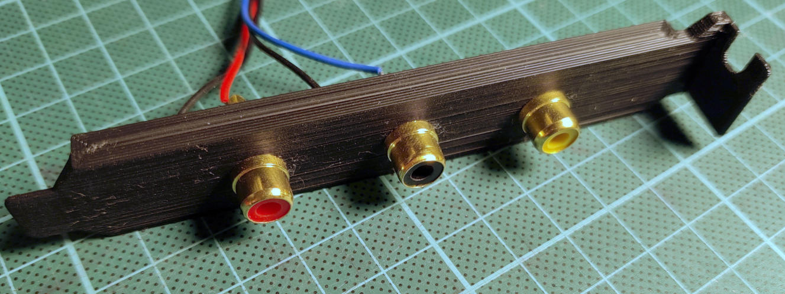

# Mechanical parts of the project

This folder holds mechanical parts, like enclosures or pc case brackets.

## [enclosure-01](enclosure-01)

This is a simple box enclosure with enough room for all PCBs.
Can be printed in simple PLA on regular 3D printers.
Designed for M3 threaded insert from [CNC Kitchen](https://cnckitchen.store/products/gewindeeinsatz-threaded-insert-m3-short-100-stk-pcs), but possibly fits others a well.
FreeCAD model is fully parametric so you can change as needed (have a look at the included sheet called "m" to change heat set inserts diameters).

Optionally lined with copper for shielding.

Optionally with a mounting base and retaining clip.
The mounting base can be glued into a PC case, and the enclosure box can be seated into it, then fixated with the retaining clip.

## [pc-bracket-rca](pc-bracket-rca)

This is a simple PC card bracket with either 2 or 3 RCA jacks.
Can be used for PCM1802 ADC input (L+R) and optionally head switch input on the 3rd jack.
Printable in simple PLA on regular 3D printers.
FreeCAD model is fully parametric so you can change as needed (have a look at the included sheet called "m-rca" to change RCA jack hole diameters).
